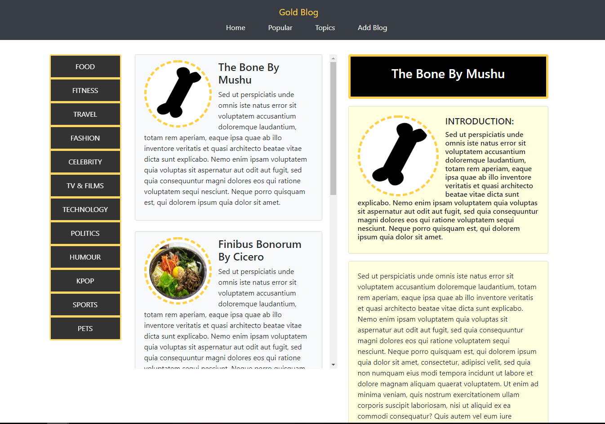
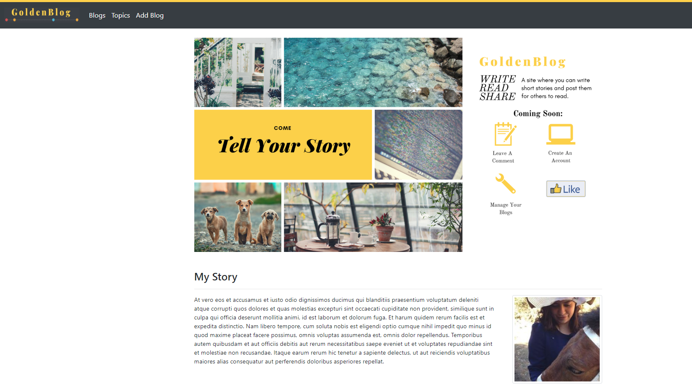

# GoldenBlog

With Gold-Blog you can read popular blogs, search blogs by topic and post your own short stories.

## Technologies

MEAN Stack (MongoDB, Express, Angular, Node.js)
* [Angular.js](https://angularjs.org/) Front-End Application Framework
* [Bootstrap](https://getbootstrap.com/) Front-End Framework
* [Node.js](https://nodejs.org/en/) Open source server framework for using JavaScript
* [Express](https://www.npmjs.com/package/express) Web server framework for Node.js
* [Body-parser](https://www.npmjs.com/package/body-parser) Request body parsing middleware for Node.js
* [MongoDB](https://www.mongodb.com/) Database
* [Mongoose](http://mongoosejs.com/) ODM

This project was generated with [Angular CLI](https://github.com/angular/angular-cli) version 6.0.7.

## Author

* Cristina Zhang - Full Stack Developer

## Deployed

Coming Soon..

## Development server

Run `ng serve` for a dev server. Navigate to `http://localhost:4200/`. The app will automatically reload if you change any of the source files.

## Code scaffolding

Run `ng generate component component-name` to generate a new component. You can also use `ng generate directive|pipe|service|class|guard|interface|enum|module`.

## Build

Run `ng build` to build the project. The build artifacts will be stored in the `dist/` directory. Use the `--prod` flag for a production build.

## Running unit tests

Run `ng test` to execute the unit tests via [Karma](https://karma-runner.github.io).

## Running end-to-end tests

Run `ng e2e` to execute the end-to-end tests via [Protractor](http://www.protractortest.org/).

## Further help

To get more help on the Angular CLI use `ng help` or go check out the [Angular CLI README](https://github.com/angular/angular-cli/blob/master/README.md).
